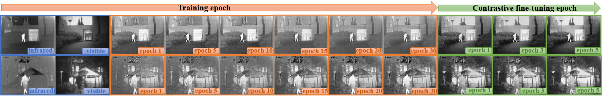
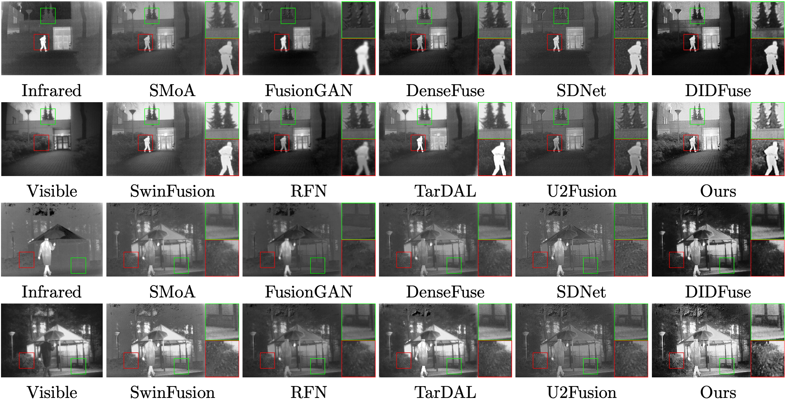
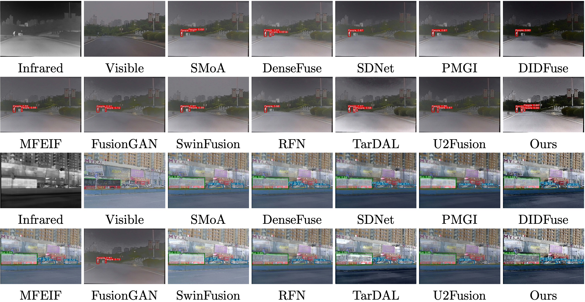

  <h1 align="left">CoCoNet: Coupled Contrastive Learning Network with Multi-level Feature Ensemble for Multi-modality Image Fusion</h1>
[Arxiv](https://arxiv.org/pdf/2211.10960.pdf)

[](https://github.com/wdhudiekou/IRFS/blob/main/LICENSE)
[](https://www.python.org/)
[](https://pytorch.org/)

## Introduction

We propose a coupled contrastive learning network, dubbed CoCoNet, to realize infrared and visible image fusion in an end-to-end manner. Concretely, to simultaneously retain typical features from both modalities and remove unwanted information emerging on the fused result, we develop a coupled contrastive constraint in our loss this http URL a fused imge, its foreground target/background detail part is pulled close to the infrared/visible source and pushed far away from the visible/infrared source in the representation space. We further exploit image characteristics to provide data-sensitive weights, which allows our loss function to build a more reliable relationship with source images. Furthermore, to learn rich hierarchical feature representation and comprehensively transfer features in the fusion process, a multi-level attention module is established. In addition, we also apply the proposed CoCoNet on medical image fusion of different types, e.g., magnetic resonance image and positron emission tomography image, magnetic resonance image and single photon emission computed tomography image. Extensive experiments demonstrate that our method achieves the state-of-the-art (SOTA) performance under both subjective and objective evaluation, especially in preserving prominent targets and recovering vital textural details.



## Installation

Clone repo:
```
git clone https://github.com/runjia0124/CoCoNet.git
cd CoCoNet
```

The code is tested with Python == 3.7, PyTorch == 1.8.1 and CUDA == 11.1 on NVIDIA GeForce RTX 2080, you may use a different version according to your GPU. 
```
conda create -n coconet python=3.7
conda install pytorch==1.8.1 torchvision==0.9.1 torchaudio==0.8.1 cudatoolkit=11.1 -c pytorch -c conda-forge
conda activate coconet
pip install -r requirements.txt
```

## Results
### Visual inspection

### Down-stream task


## Testing
```
python main.py \
--test --use_gpu \    
--test_vis ./TNO/VIS \
--test_ir ./TNO/IR 
```

## Training
Coming soon...


## Contact
Training code is not yet well sorted (will do upon accepted), any question about the code, please email us or open an issue, 

Runjia Lin(`linrunja@gmail.com`) or Jinyuan Liu (`atlantis918@hotmail.com`).

## Related work
* **CVPR 2022 Oral:** Target-aware Dual Adversarial Learning and a Multi-scenario Multi-Modality
Benchmark to Fuse Infrared and Visible for Object Detection [[paper]](https://openaccess.thecvf.com/content/CVPR2022/papers/Liu_Target-Aware_Dual_Adversarial_Learning_and_a_Multi-Scenario_Multi-Modality_Benchmark_To_CVPR_2022_paper.pdf) [[code]](https://github.com/JinyuanLiu-CV/TarDAL)

* **ICCV 2023 Oral:** Multi-interactive Feature Learning and a Full-time Multi-modality Benchmark for Image Fusion and Segmentation [[paper]](https://arxiv.org/pdf/2308.02097.pdf) [[code]](https://github.com/JinyuanLiu-CV/SegMiF)
## Acknowledgments

Template is adapted from this awesome repository. Appreciate!

* [RC-MVSNet](https://github.com/Boese0601/RC-MVSNet)

